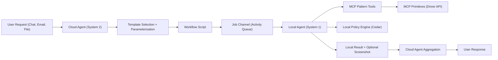
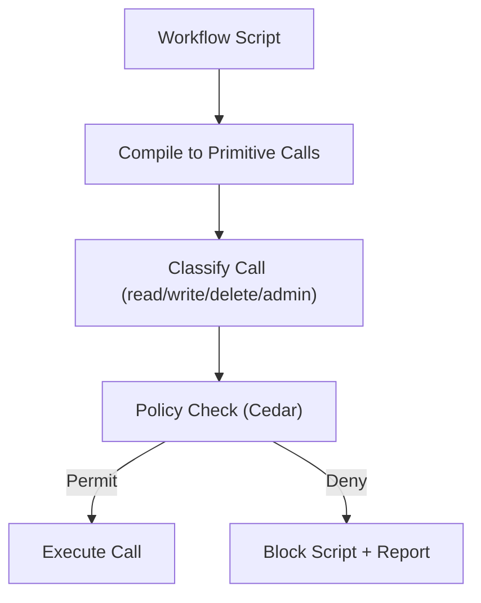
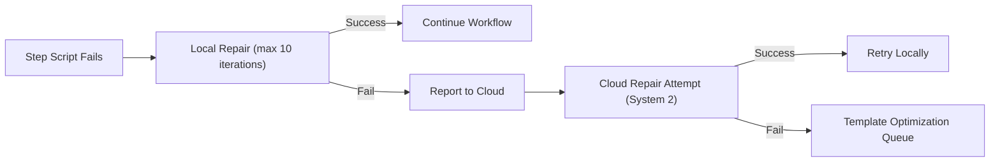

# LocalAgent

LocalAgent is an open-source local-cloud agent system for enterprise task automation. A local agent (`zeroclaw`) executes workflows with strict policy enforcement, while a cloud agent coordinates planning, template optimization, and result aggregation. MCP servers (`browser-server`) provide the automation primitives.

The design balances:
- **Security** — local policy enforcement, least privilege, audited execution
- **Reliability** — deterministic steps, bounded LLM usage, explicit retries
- **Efficiency** — pattern tools, shared template memory, minimal LLM calls
- **Flexibility** — local overlays, per-organization policies, multiple MCPs

## Repository Layout

```
LocalAgent/
  zeroclaw/           Local agent (System 1) — Rust CLI binary
    src/
      agent/          LLM-driven tool-use loop (max 10 iterations)
      channels/       Transport: Step Functions activity, Discord, Telegram, etc.
      security/       Secret store (ChaCha20-Poly1305), pairing, policy
      cron/           Scheduled job execution with retry
      tools/          Built-in tools (shell, file, web, hardware)
      ...
  mcp-servers/        MCP server workspace
    browser-server/   Binary — headless browser automation via CDP
    mcp-browser-core/ Library — 15 browser tools + code-mode engine
    server-common/    Shared bootstrap (CLI args, HTTP server init)
```

Both are independent git repositories managed as submodules. `zeroclaw` is the local execution engine; `mcp-servers` provides the browser automation MCP server that zeroclaw connects to.

## Getting Started

### Windows installer (recommended for end-users)

Download the latest `.msi` from [GitHub Releases](https://github.com/ai-on-cloud/LocalAgent/releases). The installer bundles zeroclaw and all MCP servers, adds them to PATH, and lets you choose which components to install.

### From source (developers)

Prerequisites:
- Rust toolchain (stable)
- [just](https://github.com/casey/just) command runner
- Chrome/Chromium (for browser-server)

#### Install everything

```sh
just install
```

#### Install zeroclaw

```sh
# From source
cargo install --path zeroclaw

# Or using just
cd zeroclaw && just install
```

#### Install browser-server

```sh
# From source
cargo install --path mcp-servers/browser-server

# Or using just
cd mcp-servers && just install
```

### Run

```sh
# Start the browser MCP server
cd mcp-servers && just run

# Start zeroclaw (configure your provider API key first)
zeroclaw
```

## Core Concepts

- **Workflow Script**: High-level flow selected by the cloud agent for a use case.
- **Step Script**: Pre-approved, reusable code-mode sequences (login, search, select, submit).
- **Code-Mode**: Validated-then-executed browser automation scripts. The LLM writes JavaScript using an `api.post`/`api.get` interface; the script is parsed, risk-assessed, and signed with an HMAC approval token before execution.
- **Pattern Tools**: MCP tools that wrap step scripts and compile to primitives.
- **System 1**: Local agent (`zeroclaw`), fast execution, bounded LLM for perception/selection.
- **System 2**: Cloud agent, deeper reasoning, template optimization, aggregation.

## System Components

Local (System 1):
- **zeroclaw**: Executes workflow scripts, enforces policy, manages sessions.
- **Local Policy Engine**: Cedar policies evaluated per call and per script.
- **Browser MCP** (`browser-server`): CDP-backed primitives + pattern tools for web workflows.
- **OS MCP**: Native UI automation primitives + pattern tools for desktop apps.
- **Local Secret Store**: ChaCha20-Poly1305 encrypted credentials stored at `~/.zeroclaw/`. Key file is permission-locked (0600 on Unix, per-user ACL on Windows). Secrets are decrypted in-memory only when needed for a session; raw credentials never leave the local machine.

Cloud (System 2):
- **Cloud Agent**: Selects templates, orchestrates multi-agent runs, aggregates results.
- **Template Library**: Shared memory of optimized workflows and step scripts.
- **Review Pipeline**: Human/LLM review for security and reliability.
- **Artifact Store**: Optional screenshot uploads for cloud extraction/verification.

Transport:
- **Job Channel**: AWS Step Functions activity-based long-poll. zeroclaw calls `GetActivityTask` on a configurable ARN, receives task payloads as JSON, sends results via `SendTaskSuccess`, and sends heartbeats every 30 seconds during execution. Configurable via `activity_arn`, `worker_name`, `aws_profile`, `aws_region`, `poll_interval_ms` (default 1000), and `heartbeat_interval_secs` (default 30).
- **Object Store**: Screenshot uploads for verification and OCR/vision.

## End-to-End Flow



## Execution and Policy Enforcement

Every workflow is compiled into primitive calls. Each call is classified into a permission bucket and evaluated against local policy. If any call is denied, the script is blocked.

Permission buckets:
- `read`: locate, wait, extract, screenshot
- `write`: fill, click submit, select option
- `delete`: clear, remove, cancel
- `admin`: execute_js, download/upload, clipboard, app launch

Policy modes (per bucket):
- `allow-all`
- `deny-all`
- `allow-list` (resources like domains, apps, windows)
- `block-list` (resources to deny)



## Code-Mode: Validate-Then-Execute

Code-mode uses a two-phase execution model to prevent arbitrary code execution:

1. **validate_code** — The LLM-generated script (JavaScript using `api.post`/`api.get`) is parsed via SWC, analyzed for risk (GraphQL query complexity, mutation detection, data access patterns), and if approved, returns a `normalized_code` string and an HMAC-signed `approval_token`.
2. **execute_code** — Accepts only the exact normalized code with its matching approval token. The token is verified before execution; any modification invalidates it.

This ensures the LLM cannot bypass validation or execute code that wasn't explicitly approved.

## LLM Tiering and Extraction Plan

Local LLM is intentionally weaker than cloud LLM. Use it for bounded perception and selection only. Use cloud LLM for OCR/vision and complex reasoning.

Field extraction plan:
- `dom_local`: OCR-hard tokens extracted locally from HTML
- `screenshot_cloud`: OCR/vision extraction in the cloud
- `derived_cloud`: complex reasoning and computed values
- `both`: local extraction with cloud cross-check

This split makes the System 1 and System 2 responsibilities explicit and enforceable in the schema.

## Retry and Repair Bounds

All retry loops have explicit, bounded limits to prevent runaway execution:

| Component | Max Attempts | Backoff | Cap |
|---|---|---|---|
| Agent tool-use loop | 10 iterations per message | — | Hard stop |
| Provider API calls | 3 (1 + 2 retries) | 500ms exponential | 10s |
| Cron job scheduler | 3 (1 + 2 retries) | 200ms exponential + jitter | 30s |
| Rate limit (429) | Rotates API key, then retries | Respects Retry-After header | 30s |
| Gateway pairing | 5 failed attempts | — | 5 min lockout |
| Channel reconnect | Unlimited (daemon) | 2s initial | 60s |

Non-retryable conditions (skipped immediately): HTTP 4xx (except 429/408), security policy denials.

### Step Script Repair Loop

If a step script fails, the local agent attempts bounded repairs (up to the tool-use iteration limit). If those fail, the cloud agent attempts a stronger fix and feeds the result into the template optimization pipeline.



## MCP Tooling Model

MCP servers provide two layers:
- **Pattern tools**: pre-approved step scripts like login, search, select, submit.
- **Primitives**: low-level driver calls for code-mode and repairs.

`browser-server` exposes 15 tools across four categories:

| Category | Tools |
|---|---|
| Navigation | `navigate`, `list_pages`, `select_page`, `wait` |
| Input | `click`, `fill`, `press_key`, `hover`, `handle_dialog` |
| Extraction | `screenshot`, `extract_table`, `get_text`, `evaluate_script` |
| Code-mode | `validate_code`, `execute_code` |

Pattern tools are preferred for reliability. Code-mode is allowed for repairs and edge cases under policy constraints.

## Template Lifecycle

1. **Author**: Organization admin creates workflow in the workflow studio.
2. **Optimize**: Cloud agent improves templates from aggregated runs.
3. **Review**: Security and reliability review before release.
4. **Dispatch**: Cloud selects and parameterizes the workflow.
5. **Execute**: Local agent runs with policy enforcement and bounded LLM use.
6. **Learn**: Failures and successes feed the optimization pipeline.

## Example Use Cases

### Browser-based data extraction with policy enforcement

1. Cloud agent selects the "vendor-portal-extract" template and dispatches via Step Functions activity queue.
2. zeroclaw picks up the task, loads the local browser profile (credentials stay in encrypted secret store).
3. `browser-server` executes pattern tools: `navigate` to portal, `fill` search form, `click` submit.
4. Policy engine evaluates each call — `read` operations on `vendor-portal.example.com` are allowed; `admin` calls (like `evaluate_script`) are denied per org policy.
5. `extract_table` pulls structured data from HTML locally (`dom_local`).
6. `screenshot` is uploaded to cloud for OCR/vision extraction of PDF-embedded values (`screenshot_cloud`).
7. Cloud agent aggregates local + cloud extractions and returns the result.

### Code-mode repair after UI change

1. A step script fails because a CSS selector changed after a site redesign.
2. zeroclaw's repair loop generates a new script via local LLM, calls `validate_code` — the script is parsed, risk-assessed, and signed.
3. `execute_code` runs the approved script. The repair succeeds within 3 iterations.
4. The successful repair is reported to the cloud agent, which updates the template library so future runs use the corrected selector.

## Extensibility

The architecture supports multiple MCP servers (Browser MCP, OS MCP, future MCPs) without changing core policy logic. The `mcp-servers` workspace makes it straightforward to add new servers as workspace members. New domains are integrated by adding:
- Pattern tools for common workflows
- Resource scopes for policy matching
- Template definitions and extraction plans

## Non-Goals

- Local agent does not require offline execution.
- Cloud agent does not receive local secrets or raw credentials.
- Policies are not enforced by a cloud service; they are local-only.
- No local model fine-tuning or training — local LLM is used for perception/selection only.
- No credential synchronization to cloud — all secrets remain in the local encrypted store.
- No real-time streaming of browser sessions — screenshots are uploaded as discrete artifacts.
